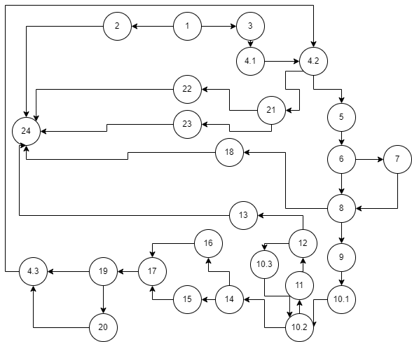

# SI_2024_lab2_223154
Stefanija Lazareva 223154

2. CFD

3. Цикломатска комплексност

I.

E - N + 2

E - број на ребра = 36

N - број на јазли = 28

36 - 28 + 2 = 10

II.

Цикломатската комплексност е еднаква на бројот на региони (регион е секој затворен простор во графот) и доколку ги изброиме регионите добиваме 10.

4. Тест случаи според Every Branch

Критериумот Every Branch треба да ги покрие сите гранки во графот. Со следниве тест случаи ги покриваме сите гранки во графот:

| Branches  | allitems=[], payment=X| allitems=[null, "266266", "100", "0"], payment=150 |    allitems=["Test7", "266c", "55", 0], payment=100   |   allitems=["Test7", null, X, X], payment=X   |   allitems=["Test7", "2662", "355", 10], payment=150  |  |
|-----------|------------------------|----------------------------------------|-------------------------------------------------------|----------------------------------------|-----------|--|
|1-2| 1 |0     |0|0| 0 |  TRUE |
|1-3| 0 |1     |1|1| 1 |  TRUE|
|2-24| 1 |0    |0|0| 0 |  TRUE|
|3-4.1| 0 |1   |1|1| 1 |  TRUE|
|4.1-4.2| 0 |1 |1|1| 1 |  TRUE |
|4.2-5|   0 |1 |1|1| 1 |  TRUE|
|4.2-21|  0 |1 |0|0| 1 |  TRUE|
|4.3-4.2| 0 |1 |0|0| 1 |  TRUE|
|5-6|    0  |1 |1|1| 1 |  TRUE|
|6-7|    0  |1 |0|0| 0 |  TRUE|
|6-8|    0  |0 |1|1| 1 |  TRUE |
|7-8|  0    |1 |0|0| 0 |  TRUE|
|8-9|   0   |1 |1|0| 1 |  TRUE|
|8-18|  0   |0 |0|1| 0 |  TRUE|
|9-10.1| 0  |1 |1|0| 1 |  TRUE|
|10.1-10.2| 0|1|1|0| 1 |  TRUE|
|10.2-11|  0 |1|1|0| 1 |  TRUE|
|10.2-14|  0|1 |0|0| 1 |  TRUE |
|10.3-10.2| 0|1|1|0| 1 |  TRUE|
|11-12|   0  |1|1|0| 1 |  TRUE|
|12-10.3|  0 |1|1|0| 1 |  TRUE|
|12-13|    0 |0|1|0| 0 |  TRUE |
|13-24|  0   |0|1|0| 0 |  TRUE|
|14-15|   0  |0|0|0| 1 |  TRUE|
|14-16|   0  |1|0|0| 0 |  TRUE|
|15-17|   0 |0 |0|0| 1 |  TRUE |
|16-17|  0 |1  |0|0| 0 |  TRUE|
|17-19|0   |1  |0|0| 1 |  TRUE|
|18-24| 0  |0  |0|1| 0 |  TRUE |
|19-20|  0 |0  |0|0| 1 |  TRUE|
|19-4.3|  0 |1 |0|0| 0 |  TRUE |
|20-4.3|  0 |0 |0|0| 1 |  TRUE|
|21-22|  0  |1 |0|0| 0 |  TRUE |
|21-23| 0  |0  |0|0| 1 |  TRUE|
|22-24| 0   |1 |0|0| 0 |  TRUE|
|23-24| 0   |0 |0|0| 1 |  TRUE |

5. Според Multiple Condition ги испитуваме сите можни комбинации на условот if (item.getPrice() > 300 && item.getDiscount() > 0 && item.getBarcode().charAt(0) == '0'). Овој услов се состои од 3 предуслови, кои треба да ги испитаме во сите можни комбинации (TTT, TTF, TFT, TFF, FTT, FFT, FTF, FFF).

| item.getPrice() > 300  |    item.getDiscount() > 0   |   item.getBarcode().charAt(0) == '0'   |   RESULT  |test case example|
|------------------------|-----------------------------|----------------------------------------|-----------|--|
| T                      |     T                       |     T	                                |   T       |  price = 400, discount = 5, code = "0147"|
| T	                     |     T                       |     F                                  |   F       |  price = 400, discount = 5, code = "147"|
| T	                     |     F                       |     X                                  |   F       |  price = 400, discount = -5, code = X|
| F                      |     X                       |     X                                  |   F       |  price = 299, discount = X, code = X|

