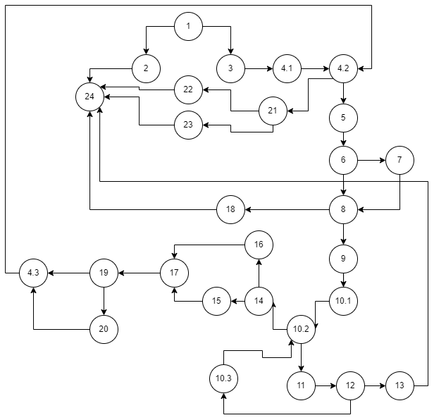

# SI_2024_lab2_223154
Stefanija Lazareva 223154

2. CFD

3. Цикломатска комплексност

I.

E - N + 2

E - број на ребра = 36

N - број на јазли = 28

36 - 28 + 2 = 10

II.

Цикломатската комплексност е еднаква на бројот на региони (регион е секој затворен простор во графот) и доколку ги изброиме регионите добиваме 10.

4. Тест случаи според Every Branch

Критериумот Every Branch треба да ги покрие сите гранки во графот. Со следниве тест случаи ги покриваме сите гранки во графот:

Тест случај 1: allitems == null

List<Item> allItems = null;

int payment = 100;

SILab2.checkCart(allItems, payment); //RuntimeException("allItems list can't be null!")

Тест случај 2: item.getName() == null

List<Item> allItems = new ArrayList<>();

allItems.add(new Item(null, "123456", 100, 0.1f));

int payment = 100;

boolean result = SILab2.checkCart(allItems, payment); //name will be set to "unknown"

Тест случај 3: item.getName.length() == 0

List<Item> allItems = new ArrayList<>();

allItems.add(new Item("", "123456", 100, 0.1f));

int payment = 100;

boolean result = SILab2.checkCart(allItems, payment); //name will be set to "unknown"

Тест случај 4: item.getBarcode() == null

List<Item> allItems = new ArrayList<>();

allItems.add(new Item("item1", null, 100, 0.1f));

int payment = 100;

SILab2.checkCart(allItems, payment); //RuntimeException("No barcode!")

Тест случај 5: item.getBarcode да има невалиден карактер

List<Item> allItems = new ArrayList<>();

allItems.add(new Item("item1", "12345a", 100, 0.1f));

int payment = 100;

SILab2.checkCart(allItems, payment); //RuntimeException("Invalid character in item barcode!")

Тест случај 6: item.getDiscount() > 0

List<Item> allItems = new ArrayList<>();

allItems.add(new Item("item1", "123456", 100, 0.1f));

int payment = 90;

boolean result = SILab2.checkCart(allItems, payment); //sum = 10.0

Тест случај 7: item.getDiscount()<=0

List<Item> allItems = new ArrayList<>();

allItems.add(new Item("item1", "123456", 100, 0.0f));

int payment = 100;

boolean result = SILab2.checkCart(allItems, payment); //sum = 100

Тест случај 8: item.getPrice()>300 && item.getDiscount()>0 && item.getBarcode().charAt(0)=='0'

List<Item> allItems = new ArrayList<>();

allItems.add(new Item("item1", "012345", 400, 0.1f));

int payment = 370;

boolean result = SILab2.checkCart(allItems, payment); //sum = 10.0 -> sum -= 30

Тест случај 9: sum<=payment

List<Item> allItems = new ArrayList<>();

allItems.add(new Item("item1", "123456", 100, 0.1f));

int payment = 10;

boolean result = SILab2.checkCart(allItems, payment); //true

Тест случај 10: sum>payment

List<Item> allItems = new ArrayList<>();

allItems.add(new Item("item1", "123456", 100, 0.1f));

int payment = 5;

boolean result = SILab2.checkCart(allItems, payment); //false

